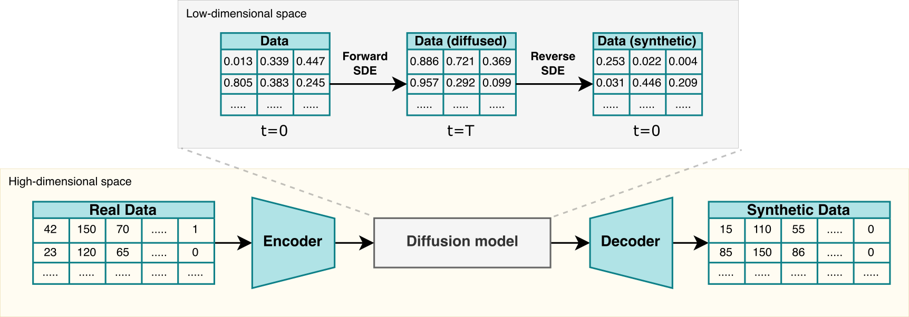

<h1 align='center'>ScoEHR</h1>
<h3 align='center'>Generating synthetic Electronic Health Records using <br>continuous-time diffusion models</h3>

<div align="center">



</div>

TBC

## Requirements

### Conda Instructions

```
conda create -n scoehr python=3.10
conda activate scoehr
conda install pre-commit
```

